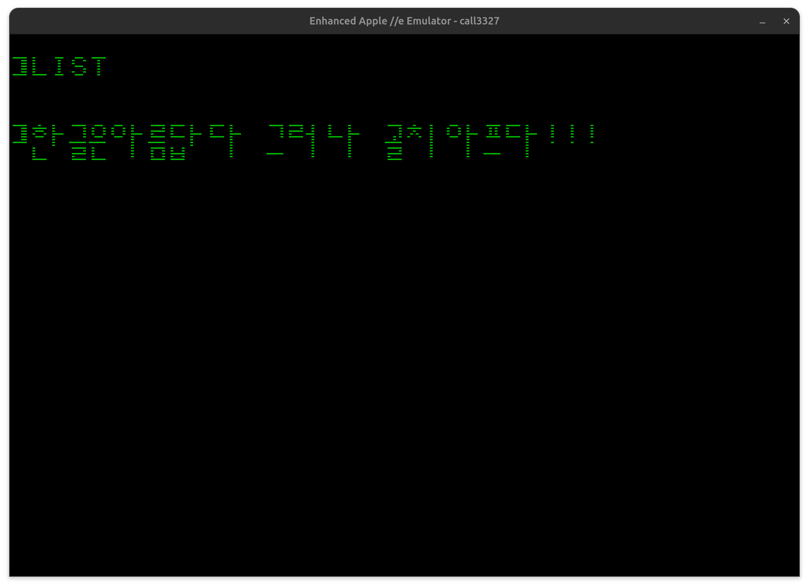
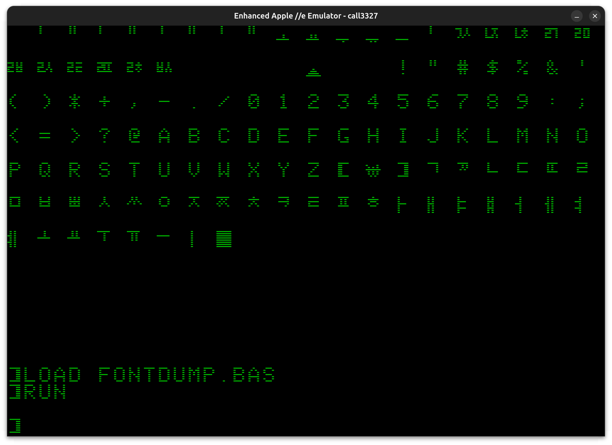
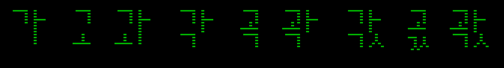

CALL3327
========

The very first Korean(Hangul) Input/Output Program for Old 8-bit Apple II series computers.

8비트 애플2 시리즈 컴퓨터용 한글 입출력 프로그램



## 복원 기록

- 월간 마이크로소프트웨어 1986년 6월호에 소개된 소스코드를 스캔
  - 참고: https://cafe.naver.com/appleii/19975
- OCR 및 수정 작업을 거쳐 복원(O <-> 0, I <-> 1, V <-> Y, ... 등)
  - 참고: https://cafe.naver.com/appleii/19979
- LISA 어셈블러로 작성된 [원본](call3327.asm)을 CA65에 맞춰 [수정](call3327.s)
- CALL3327을 사용한 프로그램의 디스크이미지로 부터 글꼴 추출
  - 참고: https://cafe.naver.com/appleii/19811

## 사용하기

### 준비물

- [디스크 이미지](call3327.dsk)
- [ADTPro](https://github.com/ADTPro/adtpro)와 [애플2용시리얼카드](https://en.wikipedia.org/wiki/Apple_II_serial_cards)
- 윈도용 에뮬레이터 [AppleWin](https://github.com/AppleWin/AppleWin)
- 맥OS용 에뮬레이터 [Virtual \]\[](https://github.com/AppleWin/AppleWin)(상업용)
- 리눅스용 에뮬레이터 [LinApple](https://github.com/linappleii/linapple)

### 실행 

1. 디스켓 또는 디스크 이미지로 부팅
2. 부팅 후 `BRUN CALL3327` 명령어로 한글 입력/출력 프로그램 로드 & 실행
3. 모든 폰트를 출력하려면 `RUN FONTDUMP.BAS`



### 사용법

- `Ctrl-K`: 한글 입력 모드
- `Ctrl-E`: 영문 입력 모드
- `Reset`: 진짜 텍스트 모드로 전환
- `CALL 3327`: 한글 입출력 모드(HGR)로 전환
- TBW: ...

## 빌드

- [CC65](https://cc65.github.io/) 설치
- 부팅되는 애플 DOS 3.3 디스크 이미지
  - 예: [DOS 3.3 System Master](https://archive.org/details/011a_DOS_3.3_System_Master)
- 애플 디스크 이미지 조작 프로그램
  - [AppleCommander](https://applecommander.github.io/)
  - [CiderPress](https://a2ciderpress.com/)

> [build.sh](build.sh) 참조

## 내부 구조

- $880: 로더.
- $8FF..$CFE: 글꼴
- $CFF: 진입점
- TBW ...

### 글꼴 조합 규칙
 
|중성\종성| 없음 |단자음/쌍자음|복자음| 너비 | 높이 |
|---------|------|-------------|------|------|------|
| 세로모음|  가  |   각 / 갂   |  갃  | 14px | 16px |
| 가로모음|  고  |   곡 / 곢   |  곣  | 7px  | 16px |
| 복모음  |  과  |   곽 / 곾   |  곿  | 14px | 16px |



#### 중성 가로 모음 + 종성 없음
* ex. 고
```
[ㄱ]
[ㅗ]
```

#### 중성 세로 모음 + 종성 없음
* ex. 가
```
[ㄱ] [ㅏ]
[  ] [ㅣ]
```

#### 중성 복모음 + 종성 없음
* ex. 과
```
[ㄱ][ㅏ]
[ㅗ][ㅣ]
```

##### 중성 가로 모음 + 종성 단자음 or 쌍자음 or 복자음
* 한칸 모음 초성과 겹쳐 표시
* 단자음, 쌍자음, 복자음 모두 한칸 종성
* ex. 곡, 꼭, 곣
```
[고]  [고]  [고]
[ㄱ]  [ㄲ]  [ㄳ] 
```

##### 중성 세로 모음 + 종성 단자음 or 쌍자음
* ex. 각, 깍
```
[ㄱ][ㅏ]  [ㄱ][ㅏ]
[ㄱ][  ]  [ㄲ][  ]
```
* 주의: 이거 아님!
```
[ㄱ][ㅏ]  [ㄱ][ㅏ]
[  ][ㄱ]  [ㄱ][ㄱ]
```

###### 중성 세로 모음 + 종성 복자음
* ex. 갃, 곿
```
[ㄱ][ㅏ]  [고][ㅏ]
[ㄱ][ㅅ]  [ㄱ][ㅅ]
```

##### 중성 복모음 + 종성 단자음 or 쌍자음
* ex. 곽
```
[고][ㅏ]  [고][ㅏ]
[ㄱ][  ]  [ㄲ][  ]
```

##### 중성 복모음 + 종성 복자음
* ex. 곿
```
[ㄱ][ㅏ]  [고][ㅏ]
[ㄱ][ㅅ]  [ㄱ][ㅅ]
```

---
May the **SOURCE** be with you...
